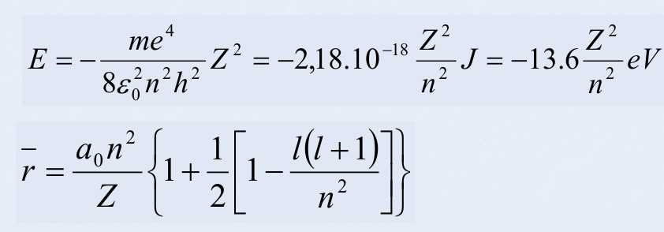
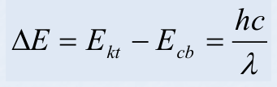

# Chương I - Cấu tạo nguyên tử
## Ⅰ. NGUYÊN TỬ VÀ QUANG PHỔ NGUYÊN TỬ
### 1. Nguyên tử
- e
- p
- n
### 2. Quang phổ nguyên tử
- quang phổ vạch
- quang phổ phát xạ nguyên tử

## ⅠⅠ. NGUYÊN TỬ VÀ QUANG PHỔ NGUYÊN TỬ
1. Thuyết cấu tạo nguyên tử của Thompson (1898)
    + Positive-Negative Pudding
2. Mẫu hành tinh nguyên tử của Rutherford(1911)
    + Mẫu hành tinh nguyên tử: n + p trong nhân, e ở ngoài quay quanh
3. Mẫu nguyên tử theo Bohr(1913)
    + e quay quanh các quỹ đạo cho sẵn + thay đổi = toả ra / hấp thụ năng lượng = ánh sáng
4. Mẫu nguyên tử của Sommerfeld
## ⅠⅠⅠ. CẤU TRÚC LỚP VỎ e NGUYÊN TỬ THEO CƠ HỌC LƯỢNG TỬ
1. Tính lưỡng nguyên của các hạt vi mô:
    - Các hạt vi mô có cả tính chất hạt và sóng.
        + Bản chất hạt: m, r, v xác định <=> Bản chất sóng λ

    - Liên hệ: λ = h / (mv)
        Trong đó:
        + m có đơn vị kg
        + v có đơn vị m/s
        + λ có đơn vị m.
        + h là hằng số: 6.626 * 10^-34 J/s.
    
    - Với hạt vĩ mô, λ quá nhỏ để quan tâm.
2. Nguyên lý bất định Heisenberg và khái niệm đám mây nguyên tử
    1. Nguyên lý bất định Heisenberg (1927)
        - Không thể đồng thời xác định chính xác cả vị trí và tốc độ của hạt vi mô. ΔxΔv >= h / (2πm) = ħ / m (ħ: h gạch / h rút gọn)
            + Với vật lớn: Sai số là không đáng kể (rất bé)
            + Với vật nhỏ: Có sai số lớn (so với nó), kể cả khi hy sinh vận tốc của e
    
    2. Khái niệm đám mây e   

        - Không thể dùng khái niệm quỹ đạo

        - CHLT: khi chuyển động xung quanh hạt nhân, e tạo ra vùng không gian mà nó có thể có mặt ở thời điểm bất kì với xác suất có mặt khác nhau.

        - Vùng không gian = đám mây e: mật độ đám mây ~ xác suất có mặt của e

        - Quy ước: đám mây e = vùng không gian gần hạt nhân: trong đó chứa khoảng 90% xác suất có mặt của e. Hình dạng đám mây = bề mặt giới hạn vùng không gian đó.

3. Phương trình sóng Schrödinger và 4 số luọng tử

    

    2. Bốn số lượng tử của electron trong điện trường 1 hạt nhân

        1. Số lượng tử chính n và các mức năng lượng
        
            - n xác định trạng thái năng lượng (tức là, mức năng lượng của electron)
            - và kích thước trung bình của đám mây electron (tức là, khoảng cách trung bình của e tới hạt nhân.)

            

            - n là giá trị nguyên dương, nhận tất cả các giá trị và tiến gần đến ∞.

            - Nếu e ở mức / trạng thái năng lượng n => có giá trị năng lượng En.

            - Emin là trạng thái cơ bản nhất của e. (n thấp nhất có thể). Nếu n > min => trạng thái kích thích, dễ quay về mức thấp hơn.

            - Công thức chuyển mức năng lượng: 
            - Trong đó:
                + h là hằng số Planck, h = 6.626 × 10-34

4. Nguyên tử nhiều e

    1. Với 1 e:

        - n=1: 1s -> trạng thái cơ bản: 1e ở đây
        - n=2: 2s, 2p...
    
    2. Nhiều e:
