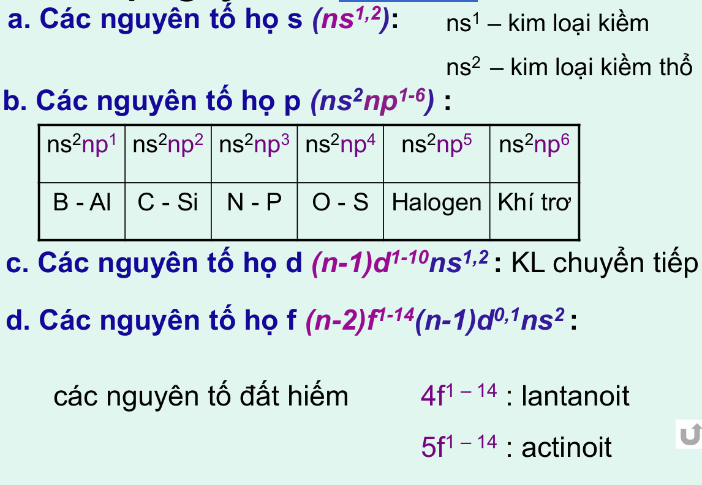

## Chương 2. HỆ THỐNG TUẦN HOÀN CÁC NGUYÊN TỐ HÓA HỌC

# I. Định luật tuần hoàn và điện tích hạt nhân nguyên tử

    - Tính chất các đơn chất cũng như dạng tính chất của các hợp chất thay đổi tuần hoàn theo chiều tăng điện tích hạt nhân nguyên tử.

# I. Cấu trúc e nguyên tử và hệ thống tuần hoàn các NTHH
    
1. Các họ nguyên tố s, p, d, f
    - 

4. Các xác định vị trí nguyên tố:
    - 
